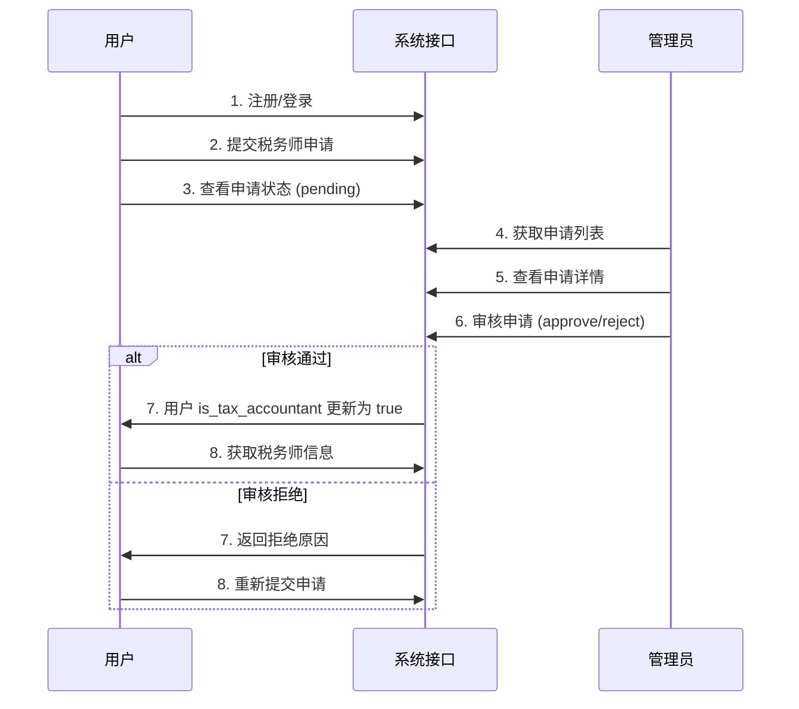

# 税务师入驻模块 API 接口文档

## 概述

税务师入驻模块提供用户申请成为税务师、管理员审核申请、税务师信息管理等功能。

**基础URL:** `http://127.0.0.1:8000`

**认证方式:** Bearer Token (JWT)

**响应格式:** JSON

---

## 通用响应结构

所有接口返回统一的响应格式：

```json
{
  "code": 1,           // 1: 成功, 0: 失败
  "message": "操作成功", // 响应消息
  "data": {}           // 响应数据
}
```

---

## 一、用户端接口

### 1.1 申请成为税务师

**接口地址:** `POST /api/tax_accountant/apply`

**认证要求:** 需要登录 (Bearer Token)

**请求参数:**

| 参数名 | 类型 | 必填 | 说明 | 示例 |
|--------|------|------|------|------|
| name | string | 是 | 真实姓名 | "张三" |
| birthDate | string | 否 | 出生日期 | "1990-01-01" |
| idCard | string | 是 | 身份证号 | "110101199001011234" |
| address | string | 否 | 现住地 | "北京市朝阳区..." |
| phone | string | 是 | 联系电话 | "13800138000" |
| certificateNo | string | 是 | 税务师证书编号 | "TA20210001" |
| certificateDate | string | 否 | 证书取得时间 | "2015-06" |
| certificateImages | string[] | 是 | 证书图片URL列表（至少1张） | ["https://...jpg"] |
| signatureImage | string | 否 | 签字确认图片URL | "https://...jpg" |
| experiences | object[] | 否 | 工作经历 | 见下方结构 |
| expertise | string | 是 | 擅长的税务业务领域 | "企业所得税" |
| settledIndex | number | 否 | 是否入驻索引（0=否, 1=是） | 1 |
| additionalInfo | string | 否 | 补充说明 | "..." |

**工作经历 (experiences) 结构:**

```json
[
  {
    "start_date": "2020-01",     // 开始时间
    "end_date": "2023-12",       // 结束时间（可选）
    "company": "某税务师事务所", // 工作单位
    "position": "税务师",        // 职务
    "work_content": "负责..."   // 工作内容（可选）
  }
]
```

**请求示例:**

```json
{
  "name": "张三",
  "birthDate": "1985-06-15",
  "idCard": "110101198506151234",
  "address": "北京市朝阳区某某街道",
  "phone": "13800138000",
  "certificateNo": "TA20210001",
  "certificateDate": "2015-06",
  "certificateImages": [
    "https://example.com/cert1.jpg",
    "https://example.com/cert2.jpg"
  ],
  "signatureImage": "https://example.com/signature.jpg",
  "experiences": [
    {
      "start_date": "2015-01",
      "end_date": "2020-12",
      "company": "某税务师事务所",
      "position": "税务师",
      "work_content": "负责企业所得税筹划和税务咨询"
    }
  ],
  "expertise": "企业所得税",
  "settledIndex": 1,
  "additionalInfo": "本人具有10年税务从业经验"
}
```

**成功响应:**

```json
{
  "code": 1,
  "message": "申请提交成功，请等待审核",
  "data": {
    "application_id": "ta_1234567890"
  }
}
```

**失败响应:**

```json
{
  "code": 0,
  "message": "您已有待审核的申请，请等待审核结果",
  "data": null
}
```

---

### 1.2 获取我的申请状态

**接口地址:** `GET /api/tax_accountant/my-application`

**认证要求:** 需要登录 (Bearer Token)

**响应示例:**

```json
{
  "code": 1,
  "message": "获取成功",
  "data": {
    "has_applied": true,
    "application_id": "ta_1234567890",
    "status": "pending",           // pending: 待审核, approved: 已通过, rejected: 已拒绝
    "reject_reason": null,
    "created_at": "2026-02-01T10:00:00"
  }
}
```

**状态说明:**

| status | 说明 |
|--------|------|
| null | 未申请 |
| pending | 待审核 |
| approved | 已通过 |
| rejected | 已拒绝 |

---

### 1.3 获取我的税务师信息

**接口地址:** `GET /api/tax_accountant/my-info`

**认证要求:** 需要登录（仅限已认证税务师）

**响应示例:**

```json
{
  "code": 1,
  "message": "获取成功",
  "data": {
    "accountant_id": "tac_1234567890",
    "user_id": "user_1234567890",
    "real_name": "张三",
    "certificate_number": "TA20210001",
    "specialty_area": ["企业所得税", "税务筹划"],
    "introduction": "10年税务从业经验",
    "status": "active",              // active: 正常, suspended: 暂停
    "service_count": 50,
    "rating": 4.8,
    "created_at": "2026-01-01T10:00:00"
  }
}
```

---

### 1.4 获取税务师列表

**接口地址:** `GET /api/tax_accountant/list`

**认证要求:** 无（公开接口）

**查询参数:**

| 参数名 | 类型 | 必填 | 说明 | 默认值 |
|--------|------|------|------|--------|
| page | number | 否 | 页码 | 1 |
| page_size | number | 否 | 每页数量（最大100） | 20 |
| status | string | 否 | 状态筛选（active/suspended） | - |
| keyword | string | 否 | 关键词搜索（姓名或手机号） | - |

**响应示例:**

```json
{
  "code": 1,
  "message": "获取成功",
  "data": {
    "total": 50,
    "page": 1,
    "page_size": 20,
    "accountants": [
      {
        "accountant_id": "tac_1234567890",
        "real_name": "张三",
        "specialty_area": ["企业所得税", "税务筹划"],
        "introduction": "10年税务从业经验",
        "service_count": 50,
        "rating": 4.8,
        "status": "active"
      }
    ]
  }
}
```

---

### 1.5 获取税务师详情

**接口地址:** `GET /api/tax_accountant/{accountant_id}`

**认证要求:** 无（公开接口）

**路径参数:**

| 参数名 | 类型 | 说明 |
|--------|------|------|
| accountant_id | string | 税务师ID |

**响应示例:**

```json
{
  "code": 1,
  "message": "获取成功",
  "data": {
    "accountant_id": "tac_1234567890",
    "real_name": "张三",
    "certificate_number": "TA20210001",
    "specialty_area": ["企业所得税", "税务筹划"],
    "introduction": "10年税务从业经验，擅长企业所得税筹划和税务风险防控",
    "service_count": 50,
    "rating": 4.8,
    "status": "active",
    "nickname": "张老师",
    "avatar_url": "https://example.com/avatar.jpg",
    "phone": "13800138000",
    "created_at": "2026-01-01T10:00:00"
  }
}
```

---

## 二、管理端接口

> 所有管理端接口需要管理员权限（Bearer Token），Token通过 `/api/admin/login` 获取

### 2.1 获取税务师申请列表

**接口地址:** `GET /api/admin/tax-accountant/applications`

**认证要求:** 管理员权限

**查询参数:**

| 参数名 | 类型 | 必填 | 说明 | 默认值 |
|--------|------|------|------|--------|
| status | string | 否 | 申请状态（pending/approved/rejected） | - |
| keyword | string | 否 | 搜索关键词（姓名、手机号、证书编号） | - |
| page | number | 否 | 页码 | 1 |
| page_size | number | 否 | 每页数量（最大100） | 20 |

**响应示例:**

```json
{
  "code": 1,
  "message": "操作成功",
  "data": {
    "total": 50,
    "page": 1,
    "page_size": 20,
    "applications": [
      {
        "application_id": "ta_1234567890",
        "user_id": "user_1234567890",
        "real_name": "张三",
        "phone": "13800138000",
        "certificate_number": "TA20210001",
        "status": "pending",
        "created_at": "2026-02-01T10:00:00"
      }
    ]
  }
}
```

---

### 2.2 获取税务师申请详情

**接口地址:** `GET /api/admin/tax-accountant/applications/{application_id}`

**认证要求:** 管理员权限

**路径参数:**

| 参数名 | 类型 | 说明 |
|--------|------|------|
| application_id | string | 申请ID |

**响应示例:**

```json
{
  "code": 1,
  "message": "操作成功",
  "data": {
    "application_id": "ta_1234567890",
    "user_id": "user_1234567890",
    "real_name": "张三",
    "birth_date": "1985-06-15",
    "id_card": "110101198506151234",
    "address": "北京市朝阳区某某街道",
    "phone": "13800138000",
    "certificate_number": "TA20210001",
    "certificate_date": "2015-06",
    "certificate_images": ["https://example.com/cert1.jpg"],
    "signature_image": "https://example.com/signature.jpg",
    "work_experiences": [
      {
        "start_date": "2015-01",
        "end_date": "2020-12",
        "company": "某税务师事务所",
        "position": "税务师",
        "work_content": "负责企业所得税筹划和税务咨询"
      }
    ],
    "specialty_area": ["企业所得税"],
    "introduction": null,
    "additional_info": "本人具有10年税务从业经验",
    "has_settled": true,
    "status": "pending",
    "created_at": "2026-02-01T10:00:00"
  }
}
```

---

### 2.3 审核税务师申请

**接口地址:** `POST /api/admin/tax-accountant/review`

**认证要求:** 管理员权限

**请求参数:**

| 参数名 | 类型 | 必填 | 说明 |
|--------|------|------|------|
| application_id | string | 是 | 申请ID |
| action | string | 是 | 审核操作：approve（通过）/ reject（拒绝） |
| reject_reason | string | 否 | 拒绝原因（拒绝时必填） |

**请求示例（通过）:**

```json
{
  "application_id": "ta_1234567890",
  "action": "approve"
}
```

**请求示例（拒绝）:**

```json
{
  "application_id": "ta_1234567890",
  "action": "reject",
  "reject_reason": "证书图片不清晰，请重新上传"
}
```

**成功响应（通过）:**

```json
{
  "code": 1,
  "message": "审核通过，税务师已入驻",
  "data": {
    "accountant_id": "tac_1234567890"
  }
}
```

**成功响应（拒绝）:**

```json
{
  "code": 1,
  "message": "已拒绝该申请",
  "data": null
}
```

---

### 2.4 获取税务师列表（管理员）

**接口地址:** `GET /api/admin/tax-accountant/list`

**认证要求:** 管理员权限

**查询参数:**

| 参数名 | 类型 | 必填 | 说明 | 默认值 |
|--------|------|------|------|--------|
| status | string | 否 | 状态筛选（active/suspended） | - |
| keyword | string | 否 | 搜索关键词（姓名、手机号） | - |
| page | number | 否 | 页码 | 1 |
| page_size | number | 否 | 每页数量（最大100） | 20 |

**响应示例:**

```json
{
  "code": 1,
  "message": "操作成功",
  "data": {
    "total": 50,
    "page": 1,
    "page_size": 20,
    "accountants": [
      {
        "accountant_id": "tac_1234567890",
        "user_id": "user_1234567890",
        "application_id": "ta_1234567890",
        "real_name": "张三",
        "phone": "13800138000",
        "certificate_number": "TA20210001",
        "specialty_area": ["企业所得税", "税务筹划"],
        "status": "active",
        "service_count": 50,
        "rating": 4.8,
        "created_at": "2026-01-01T10:00:00"
      }
    ]
  }
}
```

---

### 2.5 获取税务师统计

**接口地址:** `GET /api/admin/tax-accountant/stats`

**认证要求:** 管理员权限

**响应示例:**

```json
{
  "code": 1,
  "message": "操作成功",
  "data": {
    "total_applications": 100,    // 总申请数
    "pending_count": 10,          // 待审核数
    "approved_count": 80,         // 已通过数
    "rejected_count": 10,         // 已拒绝数
    "active_accountants": 75      // 活跃税务师数
  }
}
```

---

### 2.6 获取税务师详情（管理员）

**接口地址:** `GET /api/admin/tax-accountant/{accountant_id}`

**认证要求:** 管理员权限

**路径参数:**

| 参数名 | 类型 | 说明 |
|--------|------|------|
| accountant_id | string | 税务师ID |

**响应示例:** 同 `1.5 获取税务师详情`

---

### 2.7 更新税务师信息

**接口地址:** `PUT /api/admin/tax-accountant/{accountant_id}`

**认证要求:** 管理员权限

**路径参数:**

| 参数名 | 类型 | 说明 |
|--------|------|------|
| accountant_id | string | 税务师ID |

**请求参数:**

| 参数名 | 类型 | 必填 | 说明 |
|--------|------|------|------|
| status | string | 否 | 状态：active（正常）/ suspended（暂停） |
| specialty_area | string[] | 否 | 专长领域 |
| introduction | string | 否 | 个人简介 |

**请求示例:**

```json
{
  "status": "active",
  "specialty_area": ["企业所得税", "税务筹划", "增值税"],
  "introduction": "更新后的简介：15年税务从业经验"
}
```

**成功响应:**

```json
{
  "code": 1,
  "message": "税务师信息已更新",
  "data": null
}
```

---

### 2.8 删除税务师（暂停服务）

**接口地址:** `DELETE /api/admin/tax-accountant/{accountant_id}`

**认证要求:** 管理员权限

**路径参数:**

| 参数名 | 类型 | 说明 |
|--------|------|------|
| accountant_id | string | 税务师ID |

**说明:** 此操作会将税务师状态设为 `suspended`，而非物理删除

**成功响应:**

```json
{
  "code": 1,
  "message": "税务师已暂停服务",
  "data": null
}
```

---

## 三、业务流程说明

### 3.1 税务师入驻流程



### 3.2 状态流转

**申请状态 (tax_accountant_applications.status):**

| 状态 | 说明 | 可流转至 |
|------|------|----------|
| pending | 待审核 | approved, rejected |
| approved | 已通过 | - |
| rejected | 已拒绝 | pending（重新申请） |

**税务师状态 (tax_accountants.status):**

| 状态 | 说明 |
|------|------|
| active | 正常服务中 |
| suspended | 暂停服务 |

---

## 四、数据模型

### 4.1 税务师申请表 (tax_accountant_applications)

| 字段名 | 类型 | 说明 |
|--------|------|------|
| application_id | string | 申请ID（主键） |
| user_id | string | 用户ID |
| real_name | string | 真实姓名 |
| birth_date | date | 出生日期 |
| id_card | string | 身份证号 |
| address | string | 现住地 |
| phone | string | 联系电话 |
| certificate_number | string | 证书编号 |
| certificate_date | date | 证书取得时间 |
| certificate_images | string[] | 证书图片URL列表 |
| signature_image | string | 签字确认图片URL |
| work_experiences | jsonb | 工作经历JSON数组 |
| specialty_area | string[] | 专长领域 |
| introduction | string | 个人简介 |
| additional_info | string | 补充说明 |
| has_settled | boolean | 是否已入驻其他平台 |
| status | string | 申请状态 |
| reject_reason | string | 拒绝原因 |
| reviewed_by | string | 审核人ID |
| reviewed_at | timestamp | 审核时间 |
| created_at | timestamp | 创建时间 |
| updated_at | timestamp | 更新时间 |

### 4.2 税务师信息表 (tax_accountants)

| 字段名 | 类型 | 说明 |
|--------|------|------|
| accountant_id | string | 税务师ID（主键） |
| user_id | string | 用户ID（唯一） |
| application_id | string | 申请ID（唯一） |
| real_name | string | 真实姓名 |
| birth_date | date | 出生日期 |
| id_card | string | 身份证号 |
| address | string | 现住地 |
| phone | string | 联系电话 |
| certificate_number | string | 证书编号 |
| certificate_date | date | 证书取得时间 |
| signature_image | string | 签字确认图片URL |
| work_experiences | jsonb | 工作经历JSON数组 |
| specialty_area | string[] | 专长领域 |
| introduction | string | 个人简介 |
| additional_info | string | 补充说明 |
| status | string | 状态（active/suspended） |
| service_count | integer | 服务次数 |
| rating | decimal | 评分（0-5） |
| created_at | timestamp | 创建时间 |
| updated_at | timestamp | 更新时间 |

---

## 五、错误码说明

| code | message | 说明 |
|------|---------|------|
| 0 | 各种错误消息 | 操作失败 |
| 1 | 操作成功/获取成功 | 操作成功 |

**常见错误消息:**

| message | 场景 |
|---------|------|
| 您已有待审核的申请，请等待审核结果 | 用户已有pending状态的申请 |
| 您已是认证税务师，无需重复申请 | 用户已被认证为税务师 |
| 申请不存在 | 申请ID无效 |
| 税务师不存在 | 税务师ID无效 |
| 您还不是认证税务师 | 非税务师用户调用税务师专用接口 |
| 拒绝原因不能为空 | 拒绝审核时未填写拒绝原因 |

---

## 六、前端对接注意事项

### 6.1 字段命名约定

- **前端请求字段:** camelCase（如 `birthDate`, `certificateNo`）
- **后端响应字段:** snake_case（如 `birth_date`, `certificate_number`）

### 6.2 图片上传

证书图片和签字图片需要先通过文件上传接口获取URL，再将URL传入申请接口。

**文件上传接口:** `POST /api/files/upload`

### 6.3 用户标识字段

用户信息中新增 `is_tax_accountant` 字段，用于标识用户是否为认证税务师：

```json
{
  "user_id": "user_1234567890",
  "nickname": "张老师",
  "phone": "13800138000",
  "is_tax_accountant": true,  // 新增字段
  ...
}
```

### 6.4 权限校验建议

- 未登录用户：只能浏览税务师列表和详情
- 已登录普通用户：可以申请成为税务师、查看自己的申请状态
- 已认证税务师：可以查看自己的税务师信息
- 管理员：拥有所有管理端接口权限

---

## 七、测试接口

完整的端到端测试脚本位于: `test/test_tax_accountant_e2e.py`

运行测试：

```bash
python test/test_tax_accountant_e2e.py
```

---

## 八、更新日志

| 版本 | 日期 | 说明 |
|------|------|------|
| 1.0.0 | 2026-02-02 | 初始版本，支持税务师入驻、审核、管理功能 |
